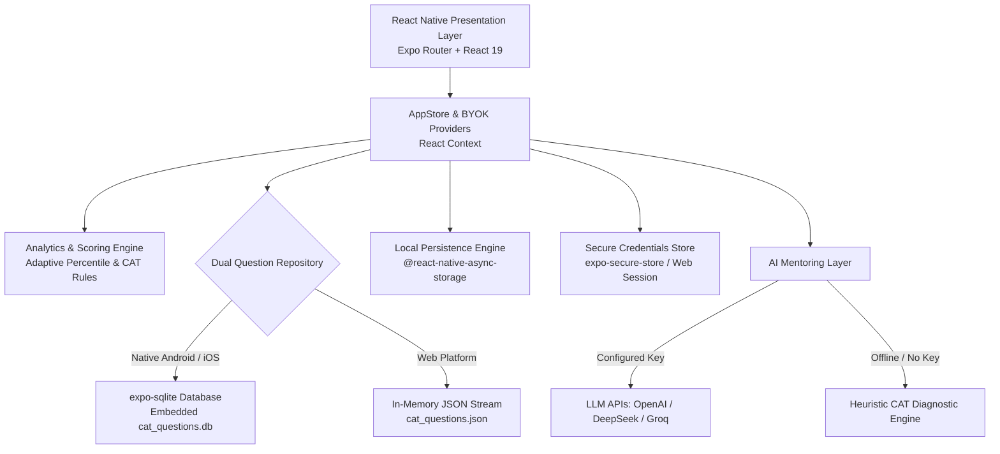

# EZCAT Documentation Hub

Welcome to the official documentation for **EZCAT** — a high-performance, cross-platform preparation companion engineered for the Indian Institute of Management Common Admission Test (IIM CAT).

EZCAT combines an authentic offline question bank of nearly 7,000 curated questions and past exam papers with real-time test simulations, algorithmic performance analytics, and an AI-powered coach.

```
  _______ ______ _____       _______ 
 |  ____|___  // ____|   /\|__   __|
 | |__     / /| |       /  \  | |   
 |  __|   / / | |      / /\ \ | |   
 | |____ / /__| |____ / ____ \| |   
 |______|_____|\_____/_/    \_\_|   
  Cross-Platform CAT Preparation Engine
```

---

## 📚 Documentation Index

Explore the comprehensive documentation guides below:

| Guide | Description | Highlights |
| :--- | :--- | :--- |
| [**1. Overview**](overview.md) | Vision, audience, core philosophy, and high-level feature breakdown | Target audience, CAT exam pattern, core pillars, design system |
| [**2. Architecture**](architecture.md) | Deep dive into system design, navigation, dual repository, and state management | Expo Router, SQLite vs Web JSON, React Context, BYOK security |
| [**3. Getting Started**](getting-started.md) | Step-by-step setup, requirements, local execution, and configuration | Node.js, Expo CLI, Android/iOS emulation, environment variables |
| [**4. Feature Deep-Dive**](features.md) | Detailed breakdown of all aspirant-facing preparation modules | Daily practice, full/sectional/mini mocks, scoring rules, AI coach |
| [**5. Database & Data Pipeline**](database-and-data.md) | SQLite schema, dataset compilation, PYQs, and rebuild safety | `schema.sql`, `build_db.py`, indices, data sanitization, TITA regex |
| [**6. Building & Distribution**](building-and-distribution.md) | Production compilation across Web, Android, iOS, and CI/CD pipelines | `npx expo export`, Gradle APK, EAS cloud build, GitHub Actions |
| [**7. Contributing Guide**](contributing.md) | Contribution standards, development workflows, and testing protocols | Issue templates, git branching, TypeScript standards, PR checklist |

---

## ⚡ Quick Architecture Overview

EZCAT is built on a modern TypeScript stack powered by **Expo SDK 57**, **React Native 0.86**, and **React 19**. It runs identical core application logic across Web, Android, and iOS while leveraging platform-specialized storage and query engines:



---

## 🎯 Key Facts & Metrics

- **6,963 Shipped Questions**: High-yield quantitative aptitude, data interpretation, logical reasoning, and verbal ability items.
- **992 Previous Year Questions (PYQs)**: Authentic historical sittings spanning CAT 2017 through CAT 2024.
- **100% Offline-First Architecture**: Solve questions, simulate mock exams, and review explanations without requiring an active internet connection.
- **Strict CAT Marking System**: Automatic $+3$ reward for correct answers, $-1$ penalty for incorrect MCQs, and $0$ penalty for non-MCQ Type-In-The-Answer (TITA) questions.
- **Rebuild-Safe Persistence**: Automatic integrity checks that reconcile user attempt logs and streaks across database schema updates without data corruption.

---

## 🔗 Repository Resources

- **GitHub Repository**: [amateuristrying/EZCAT](https://github.com/amateuristrying/EZCAT)
- **License**: MIT Open Source License
- **Maintainers**: [wantedchip](https://github.com/wantedchip) & [amateuristrying](https://github.com/amateuristrying)
