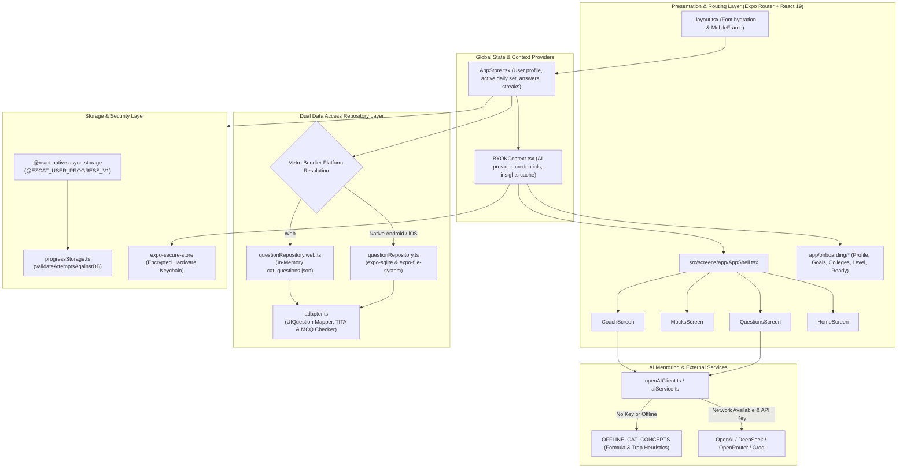
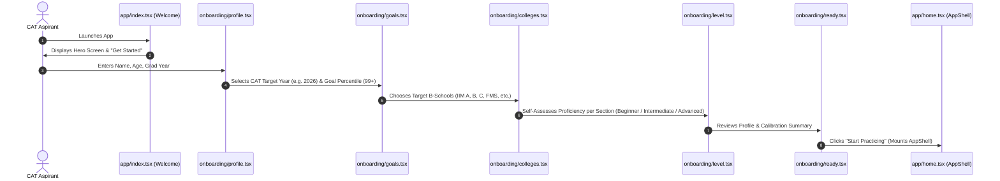
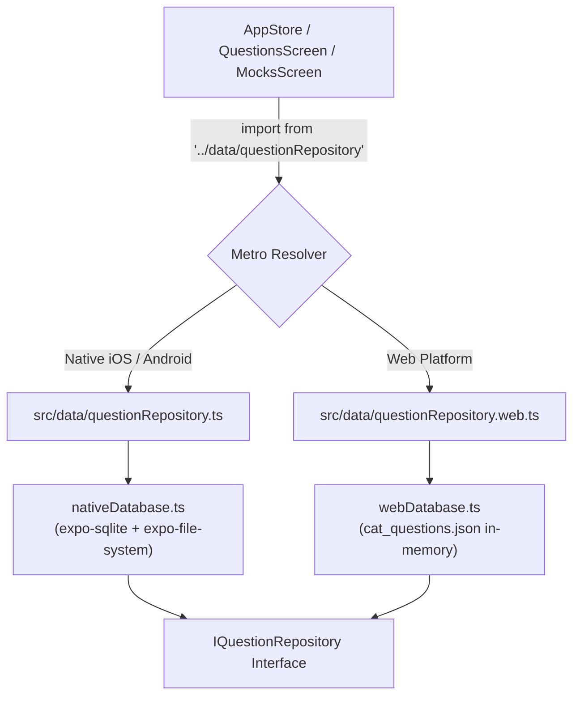
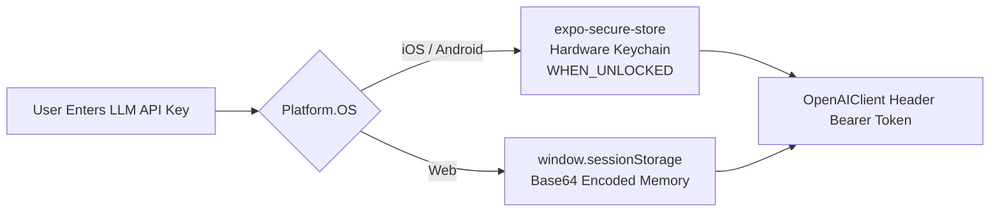

# Architecture & Technical Design

EZCAT is engineered with a modular, offline-first architecture designed to maintain platform parity across native mobile platforms (Android and iOS) and Desktop Web while handling thousands of complex questions with zero runtime lag.

---

## 🏗️ High-Level System Architecture

The following diagram illustrates the component topology and data flow within EZCAT:



---

## 🧭 File-Based Routing & Navigation Flow

EZCAT uses **Expo Router** (file-based navigation matching Next.js paradigms). All routes are located in the `app/` directory.

### Routing Directory Structure

```text
app/
├── _layout.tsx               # Root provider wrapper & font initialization
├── index.tsx                 # Route "/" -> WelcomeScreen
├── onboarding/
│   ├── profile.tsx           # Route "/onboarding/profile" (Name, Age, Grad Year)
│   ├── goals.tsx             # Route "/onboarding/goals" (Target Year & Percentile)
│   ├── colleges.tsx          # Route "/onboarding/colleges" (Dream B-Schools)
│   ├── level.tsx             # Route "/onboarding/level" (Sectional Self-Assessment)
│   └── ready.tsx             # Route "/onboarding/ready" (Confirmation & Summary)
└── home.tsx                  # Route "/home" -> AppShell (Main Tab Controller)
```

### User Onboarding Funnel

The onboarding process collects essential baseline attributes to calibrate practice recommendations:



---

## 🗄️ Dual Question Repository Pattern

A core technical challenge in universal Expo apps is handling large embedded SQLite databases across both Native and Web platforms. SQLite engines for Web typically require WebAssembly (`sql.js` or `sqlite3.wasm`) along with SharedArrayBuffer headers, which introduce bundling complexity and performance degradation.

EZCAT solves this via a **Dual Question Repository Pattern** using Metro's automatic `.web.ts` platform extension resolution.



### 1. Native SQLite Implementation (`nativeDatabase.ts`)

On native mobile devices, the pre-compiled database (`assets/cat_questions.db`) is copied on first launch from the read-only application bundle to the device's writeable document directory:

```typescript
async function getDatabase(): Promise<SQLite.SQLiteDatabase> {
  if (dbInstance) return dbInstance;

  const dbName = 'cat_questions.db';
  const dbDir = `${FileSystem.documentDirectory}SQLite`;
  const dbPath = `${dbDir}/${dbName}`;

  const folderInfo = await FileSystem.getInfoAsync(dbDir);
  if (!folderInfo.exists) {
    await FileSystem.makeDirectoryAsync(dbDir, { intermediates: true });
  }

  const fileInfo = await FileSystem.getInfoAsync(dbPath);
  if (!fileInfo.exists) {
    const asset = Asset.fromModule(require('../../assets/cat_questions.db'));
    await asset.downloadAsync();
    await FileSystem.copyAsync({
      from: asset.localUri || asset.uri,
      to: dbPath,
    });
  }

  dbInstance = SQLite.openDatabaseSync(dbName);
  return dbInstance;
}
```

### 2. Web JSON In-Memory Implementation (`webDatabase.ts`)

On Web, the compiled dataset (`assets/cat_questions.json`) is loaded into memory directly. Filter queries and random samples are processed using an efficient Fisher-Yates shuffle algorithm, guaranteeing instant responsiveness with zero WASM overhead:

```typescript
function shuffleArray<T>(array: T[]): T[] {
  const arr = [...array];
  for (let i = arr.length - 1; i > 0; i--) {
    const j = Math.floor(Math.random() * (i + 1));
    [arr[i], arr[j]] = [arr[j], arr[i]];
  }
  return arr;
}
```

Both repositories strictly implement the same contract:

```typescript
export interface IQuestionRepository {
  getDailyPracticeSet(counts: DailySetCounts): Promise<Question[]>;
  getQuestionsBySection(section: SectionType, limit?: number): Promise<Question[]>;
  getMockExam(year: number, slot: number): Promise<MockExamResult>;
  getTITAQuestion(section?: SectionType): Promise<Question | null>;
  getSimilarQuestion(section: SectionType, excludeId?: number | string): Promise<Question | null>;
}
```

---

## 🔄 The Adapter & Verification Engine (`adapter.ts`)

The database row format must be safely converted to a presentation-friendly `UIQuestion` format. Furthermore, exam answers must be verified against student input with high resilience.

### MCQ Answer Verification (`checkMCQCorrect`)
Students or answer keys may provide option labels (`"A"`, `"B"`), option prefixes (`"Choice C"`, `"B. 91"`), or verbatim option text. The adapter sanitizes both target and selected keys:

```typescript
export function checkMCQCorrect(selectedKey: string, correctAnswer: string, options: UIQuestionOption[]): boolean {
  if (!selectedKey) return false;
  const targetKey = extractCorrectKey(correctAnswer, options);
  if (selectedKey.toUpperCase() === targetKey.toUpperCase()) return true;

  // Secondary check against normalized option text
  const selectedOpt = options.find((opt) => opt.key.toUpperCase() === selectedKey.toUpperCase());
  if (selectedOpt) {
    return normalizeString(selectedOpt.text) === normalizeString(correctAnswer);
  }
  return false;
}
```

### TITA Answer Verification (`checkTITACorrect`)
For non-MCQ questions, candidates type free-form text. The adapter implements a 3-tier matching protocol:
1. Exact string match after trimming and removing commas (`"1,200"` $\rightarrow$ `"1200"`).
2. Stripped alphanumeric string match (ignoring units like `"litres"`, `"days"`, or `"%"`, and currency signs like `"Rs."` or `"$"`).
3. Regular expression numeric extraction and floating-point comparison with an absolute epsilon threshold ($\Delta < 10^{-5}$):

```typescript
export function checkTITACorrect(userAnswer: string, correctAnswer: string): boolean {
  if (!userAnswer || !correctAnswer) return false;

  const uStr = userAnswer.trim().toLowerCase().replace(/,/g, '');
  const cStr = correctAnswer.trim().toLowerCase().replace(/,/g, '');

  if (uStr === cStr) return true;
  if (normalizeString(uStr) === normalizeString(cStr)) return true;

  const userNumMatch = uStr.match(/-?\d+(\.\d+)?/);
  const corrNumMatch = cStr.match(/-?\d+(\.\d+)?/);

  if (userNumMatch && corrNumMatch) {
    const userVal = parseFloat(userNumMatch[0]);
    const corrVal = parseFloat(corrNumMatch[0]);
    if (!isNaN(userVal) && !isNaN(corrVal) && Math.abs(userVal - corrVal) < 1e-5) {
      return true;
    }
  }
  return false;
}
```

---

## 💾 State Management & Persistence (`AppStore.tsx`)

EZCAT manages global client state using React Context (`AppStoreProvider`) paired with `@react-native-async-storage/async-storage`.

### Rebuild-Safety Protocol (`validateAttemptsAgainstDB`)

When new questions are added or raw datasets re-compiled with `build_db.py`, internal SQLite row IDs may shift or change. A naive local storage system would attempt to look up stale IDs and crash or display corrupted question text.

EZCAT implements **Rebuild-Safety**:
- On loading a daily set or mock test, active question IDs are checked against stored user attempts.
- Stale question IDs are safely isolated and logged.
- Historical aggregates — such as **Day Streak**, **Total Solved**, **Total Correct**, and **Completed Mock Records** — remain completely preserved and never corrupted:

```typescript
export function validateAttemptsAgainstDB(
  storedAttempts: Record<string, QuestionAttempt>,
  validIdsSet: Set<string>
): { validAttempts: Record<string, QuestionAttempt>; staleIds: string[] } {
  const validAttempts: Record<string, QuestionAttempt> = {};
  const staleIds: string[] = [];

  for (const [qId, attempt] of Object.entries(storedAttempts || {})) {
    if (validIdsSet.has(qId)) {
      validAttempts[qId] = attempt;
    } else {
      staleIds.push(qId);
      console.warn(`[ProgressStorage] Stale question ID '${qId}' omitted from live solver state.`);
    }
  }

  return { validAttempts, staleIds };
}
```

---

## 🔒 Security & Bring-Your-Own-Key (BYOK) Architecture

EZCAT adheres to strict zero-knowledge principles regarding user AI credentials.



- **Native Mobile Security**: API keys are saved exclusively into the operating system's hardware-backed keystore/keychain using `expo-secure-store` with `WHEN_UNLOCKED` accessibility.
- **Web Security**: On web platforms, keys are held in memory and session storage (`sessionStorage`) so credentials automatically expire when the tab is closed.
- **Zero-Token Verification**: When configuring an API key, EZCAT validates credentials via a lightweight `GET /v1/models` request, confirming validity without consuming LLM token quota.
