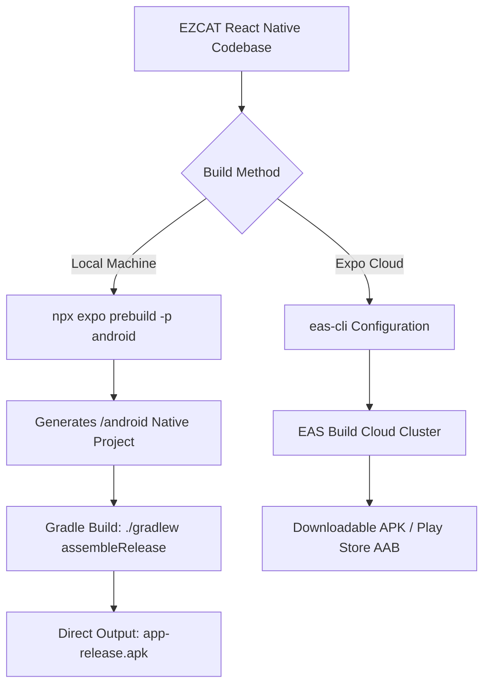

# Building & Distribution Guide

This guide provides end-to-end instructions for compiling, packaging, and distributing EZCAT across Desktop Web, Android (APK/AAB), and iOS (Simulator/IPA), including cloud and local build pipelines.

---

## 🌐 1. Compiling for Web (`dist/`)

EZCAT exports to a static single-page progressive web application (PWA) using Expo's Metro web bundler.

### Step 1: Export Static Web Files

Run the export command from the project root:

```bash
npx expo export --platform web
```

This compiles your TypeScript source code, bundles assets, and outputs a production-ready static directory to `dist/`:

```text
dist/
├── _expo/                        # Bundled JavaScript chunks & CSS styles
├── assets/                       # Images, icons, and cat_questions.json
├── favicon.png
├── index.html                    # Root HTML entry point
└── metadata.json
```

### Step 2: Test Locally

Test the production bundle locally using a static HTTP server:

```bash
npx serve dist
```

Open the displayed URL (typically `http://localhost:3000`) in your browser to verify application hydration, font rendering, and mock test execution.

### Step 3: Deploying to Static Hosting Providers

The `dist/` directory can be deployed to any static cloud hosting platform:

- **Vercel**:  
  Install Vercel CLI (`npm i -g vercel`) and run `vercel deploy --prebuilt` or set Output Directory to `dist` in the Vercel dashboard.
- **Netlify**:  
  Publish the `dist` directory via Netlify CLI (`netlify deploy --prod --dir=dist`) or connect your Git repository.
- **GitHub Pages**:  
  Push the `dist/` directory to your `gh-pages` branch using `gh-pages` npm package.
- **Cloudflare Pages**:  
  Configure build command `npx expo export -p web` and set output directory to `dist`.

---

## 🤖 2. Building for Android

You can generate installable Android APKs using either **Local Gradle Compilation** or **EAS Cloud Build**.



### Method A: Local Gradle Build via Android Studio / CLI

*Ideal for offline development, local debugging, or building without Expo cloud quotas.*

#### Prerequisites
1. **JDK 17**: Ensure Java Development Kit 17 is installed (`java -version`).
2. **Android SDK & Build Tools**: Installed via Android Studio.
3. **Environment Variables**: Verify `ANDROID_HOME` is set:
   ```bash
   # Windows PowerShell Example
   $env:ANDROID_HOME = "C:\Users\<username>\AppData\Local\Android\Sdk"
   ```

#### 1. Generate Native Android Project
Run prebuild to emit native Gradle files:
```bash
npx expo prebuild --platform android
```
This generates the `android/` directory containing native configurations matching `app.json`.

#### 2. Generate Release Keystore (for signed release builds)
Generate a private signing key using Java's `keytool`:
```bash
keytool -genkey -v -keystore ezcat-release.keystore -alias ezcat -keyalg RSA -keysize 2048 -validity 10000
```
Store `ezcat-release.keystore` securely (do not commit to public version control).

#### 3. Compile the APK
Navigate into `android/` and execute Gradle:

```bash
# On Windows PowerShell
cd android
.\gradlew assembleRelease

# On macOS / Linux
cd android
./gradlew assembleRelease
```

The completed APK will be located at:
```text
android/app/build/outputs/apk/release/app-release.apk
```

---

### Method B: EAS Build (Expo Application Services)

*Ideal when developing on machines without Android Studio or for continuous cloud builds.*

#### 1. Install EAS CLI & Log In
```bash
npm install -g eas-cli
eas login
```

#### 2. Configure `eas.json`
Run `eas build:configure` or create `eas.json` in your root directory:

```json
{
  "cli": {
    "version": ">= 15.0.0"
  },
  "build": {
    "development": {
      "developmentClient": true,
      "distribution": "internal"
    },
    "preview": {
      "distribution": "internal",
      "android": {
        "buildType": "apk"
      }
    },
    "production": {
      "android": {
        "buildType": "app-bundle"
      }
    }
  },
  "submit": {
    "production": {}
  }
}
```

#### 3. Trigger Cloud APK Build
```bash
eas build --platform android --profile preview
```

EAS will build the project in the cloud and output a direct download link for the standalone `.apk` file.

---

## 🍏 3. Building for iOS (Simulator & IPA)

Apple iOS builds require code signing and specific provisioning profiles.

### Option A: iOS Simulator Build via EAS Cloud (No Mac Required)

You can generate an iOS Simulator build even while developing on Windows:

1. In `eas.json`, configure the simulator build:
   ```json
   {
     "build": {
       "preview-simulator": {
         "ios": {
           "simulator": true
         }
       }
     }
   }
   ```
2. Trigger the cloud build:
   ```bash
   eas build --platform ios --profile preview-simulator
   ```
3. Download the resulting `.tar.gz`, extract the `.app` bundle, and drag it into the Xcode Simulator on a Mac.

---

### Option B: Physical Device / TestFlight Distribution (Requires Apple Developer Account)

To distribute EZCAT to physical iPhones or publish to TestFlight:

1. **Apple Developer Account**: Requires an active Apple Developer Program membership ($99/year).
2. **Bundle Identifier**: Defined in `app.json` as `com.ninetyninevca.ezcat`.
3. **Execute Production EAS Build**:
   ```bash
   eas build --platform ios --profile production
   ```
   EAS automatically manages certificates, app IDs, and provisioning profiles via your Apple credentials.

---

## ⚖️ Expo Free Tier Considerations

When using Expo Application Services (EAS):

| Feature | Free Tier Allowance | Production Recommendations |
| :--- | :--- | :--- |
| **Concurrent Builds** | 1 concurrent build | Sufficient for solo developers and PR previews |
| **Monthly Build Credits** | 30 Android + 30 iOS builds per month | Use local builds (`./gradlew`) for rapid dev iteration |
| **Queue Priority** | Standard queue | Builds typically take 8–15 minutes |

---

## 🤖 4. CI/CD Automation (GitHub Actions)

You can automate quality checks, TypeScript compilation, and web deployment on every pull request using GitHub Actions.

Create `.github/workflows/ci.yml`:

```yaml
name: EZCAT CI / Verification Pipeline

on:
  push:
    branches: [main]
  pull_request:
    branches: [main]

jobs:
  verify:
    name: Code Quality & Type Check
    runs-on: ubuntu-latest

    steps:
      - name: Checkout Repository
        uses: actions/checkout@v4

      - name: Setup Node.js 22.x
        uses: actions/setup-node@v4
        with:
          node-version: 22
          cache: 'npm'

      - name: Install Dependencies
        run: npm ci

      - name: Run TypeScript Type Check
        run: npx tsc --noEmit

      - name: Test Production Web Export
        run: npx expo export --platform web

      - name: Verify Web Dist Output
        run: |
          test -f dist/index.html || exit 1
          echo "Web build successfully verified."
```
