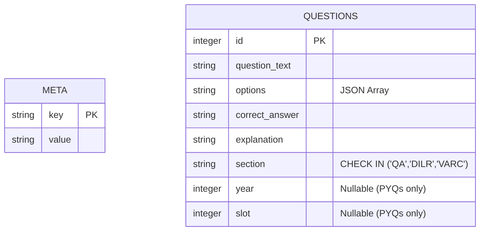
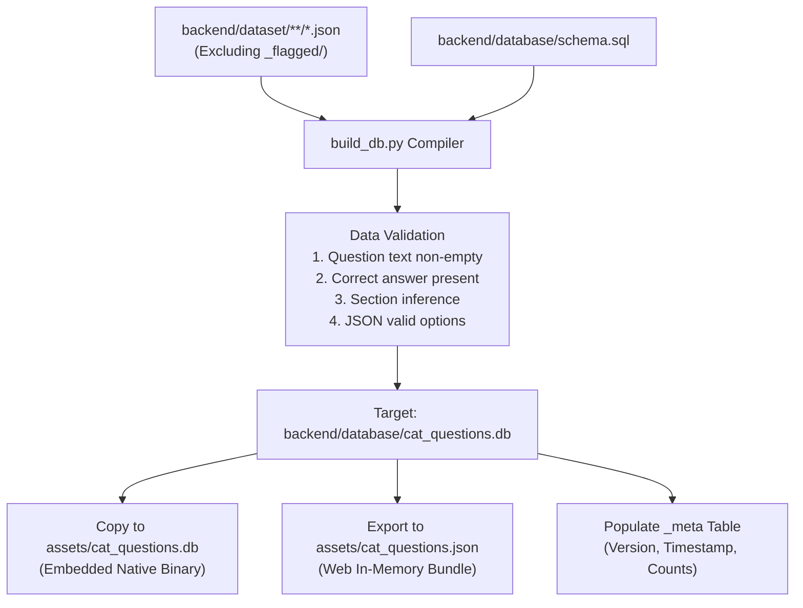

# Database & Data Pipeline

EZCAT features an offline-first data layer powered by an embedded SQLite 3 database (`cat_questions.db`) containing **6,963 questions** and a synchronized web JSON bundle (`cat_questions.json`).

This guide details the database schema, question taxonomy, dataset compilation pipeline, and user progress persistence architecture.

---

## 🗄️ SQLite Database Schema

The database schema is defined in [backend/database/schema.sql](file:///c:/Users/Lenovo/Downloads/Documents/workspace/EZCAT/backend/database/schema.sql). It is purposely streamlined for high-speed read performance and minimal storage footprint on mobile devices.



### Complete DDL Specification

```sql
-- -----------------------------------------------------------------------------
-- 1. Metadata Table
-- Key-value store for application runtime sanity checks (e.g. build_date,
-- source_row_count, schema_version).
-- -----------------------------------------------------------------------------
CREATE TABLE IF NOT EXISTS _meta (
    key TEXT PRIMARY KEY,
    value TEXT NOT NULL
);

-- -----------------------------------------------------------------------------
-- 2. Questions Table
-- Main storage for shipped question content.
-- Source provenance, raw IDs, and internal source_type columns are omitted.
-- source_type is derivable from (year IS NOT NULL).
-- MCQ vs TITA is derivable from (options IS NOT NULL AND json_array_length(options) > 0).
-- -----------------------------------------------------------------------------
CREATE TABLE IF NOT EXISTS questions (
    id INTEGER PRIMARY KEY,                   -- Plain rowid alias
    question_text TEXT NOT NULL,
    options TEXT,                             -- JSON array: [{"label":"A","text":"..."}] or [] for TITA
    correct_answer TEXT NOT NULL,
    explanation TEXT,
    section TEXT NOT NULL CHECK (section IN ('QA', 'DILR', 'VARC')),
    year INTEGER,                             -- PYQs only; NULL for practice questions
    slot INTEGER,                             -- PYQs only; NULL for practice questions
    CHECK (options IS NULL OR json_valid(options))
);

-- -----------------------------------------------------------------------------
-- 3. Performance Indices
-- -----------------------------------------------------------------------------

-- Index on section: Powers daily practice mode and topic/section filtering
CREATE INDEX IF NOT EXISTS idx_questions_section ON questions(section);

-- Index on (year, slot): Powers full mock exam assembly for a specific sitting
CREATE INDEX IF NOT EXISTS idx_questions_year_slot ON questions(year, slot);

-- Composite index on (year, slot, section): Powers section-by-section mock exam navigation
CREATE INDEX IF NOT EXISTS idx_questions_year_slot_section ON questions(year, slot, section);
```

---

## 📊 Shipped Question Inventory

As of Database Build Version `1.0`, the shipped database comprises:

| Category | Metric | Details |
| :--- | :--- | :--- |
| **Total Shipped Questions** | **6,963** | Validated, deduped, and indexed |
| **Quantitative Aptitude (QA)** | **3,911** (56.2%) | Arithmetic, Algebra, Geometry, Numbers, Modern Math |
| **Verbal Ability & RC (VARC)** | **2,089** (30.0%) | Reading Comprehension, Para Jumbles, Summary, Odd-One-Out |
| **Data Interpretation & LR (DILR)** | **963** (13.8%) | Matrix Grids, Puzzles, Arrangements, Venn Diagrams |
| **Authentic PYQs** | **992** | Extracted from real CAT papers (2017 to 2024) |
| **Practice Questions** | **5,971** | Curated topic-specific preparation drills |

---

## 🏛️ Previous Year Papers (PYQs) Coverage

Authentic past CAT sittings are stored with explicit `year` and `slot` attributes. 

### Full Mock Eligible Sittings
To qualify for a **120-Minute Full Mock Exam**, a sitting must have complete 3-section representation (`VARC > 0 AND DILR > 0 AND QA > 0`):

| Exam Sitting | Year | Slot | Total Questions | Section Breakdown |
| :--- | :---: | :---: | :---: | :--- |
| **CAT 2023 Slot 1** | 2023 | 1 | 68 Questions | VARC: 24, DILR: 20, QA: 24 |
| **CAT 2023 Slot 2** | 2023 | 2 | 69 Questions | VARC: 24, DILR: 21, QA: 24 |
| **CAT 2023 Slot 3** | 2023 | 3 | 69 Questions | VARC: 24, DILR: 21, QA: 24 |
| **CAT 2022 Slot 1** | 2022 | 1 | 76 Questions | VARC: 26, DILR: 24, QA: 26 |
| **CAT 2022 Slot 2** | 2022 | 2 | 65 Questions | VARC: 24, DILR: 19, QA: 22 |
| **CAT 2022 Slot 3** | 2022 | 3 | 70 Questions | VARC: 24, DILR: 22, QA: 24 |
| **CAT 2021 Slot 1** | 2021 | 1 | 71 Questions | VARC: 24, DILR: 23, QA: 24 |
| **CAT 2021 Slot 2** | 2021 | 2 | 71 Questions | VARC: 24, DILR: 23, QA: 24 |
| **CAT 2021 Slot 3** | 2021 | 3 | 71 Questions | VARC: 24, DILR: 23, QA: 24 |
| **CAT 2020 Slot 1** | 2020 | 1 | 71 Questions | VARC: 25, DILR: 22, QA: 24 |
| **CAT 2020 Slot 2** | 2020 | 2 | 68 Questions | VARC: 24, DILR: 20, QA: 24 |
| **CAT 2020 Slot 3** | 2020 | 3 | 77 Questions | VARC: 26, DILR: 25, QA: 26 |

---

## ⚙️ Dataset Compilation Pipeline (`build_db.py`)

The database compilation script ([backend/database/build_db.py](file:///c:/Users/Lenovo/Downloads/Documents/workspace/EZCAT/backend/database/build_db.py)) transforms raw canonical JSON sources into an optimized SQLite binary and web JSON bundle.



### Key Compilation Steps

1. **Clean Rebuild Strategy**: Removes existing database files to prevent stale primary keys or orphan rows.
2. **DDL Application**: Executes `schema.sql` verbatim using Python's native `sqlite3` driver.
3. **Section Inference Heuristic (`infer_section`)**: Evaluates question keywords, topics, and source file metadata to resolve section categories (`QA`, `DILR`, or `VARC`) for unlabelled records.
4. **Data Sanitization & Integrity Checks**:
   - Skips records with null or whitespace-only question stems.
   - Ensures `options` is properly formatted as a JSON array.
   - Converts TITA items into empty arrays `[]`.
5. **Multi-Target Synchronization**:
   - Generates `backend/database/cat_questions.db`
   - Copies file to `assets/cat_questions.db` for native bundling
   - Exports compact JSON to `assets/cat_questions.json` for web execution
6. **Compilation Auditing**: Generates a terminal report detailing total records considered, rows inserted, and breakdown percentages.

---

## 💾 User Progress Persistence & Rebuild-Safety

User learning data is persisted locally via `AsyncStorage` under the key:
```text
@EZCAT_USER_PROGRESS_V1
```

### TypeScript Data Structures (`progressStorage.ts`)

```typescript
export interface QuestionAttempt {
  questionId: string;
  rawId: number;
  section: 'varc' | 'dilr' | 'qa';
  isCorrect: boolean;
  userAnswer: string;
  timestamp: string; // ISO 8601
}

export interface MockAttempt {
  id: string; // e.g. "mock_1720000000"
  type: 'full' | 'sectional' | 'mini';
  title: string;
  year?: number | null;
  slot?: number | null;
  section?: 'varc' | 'dilr' | 'qa' | null;
  timestamp: string;
  timeTakenSec: number;
  totalQuestions: number;
  attemptedCount: number;
  correctCount: number;
  incorrectCount: number;
  unattemptedCount: number;
  totalScore: number;
  maxPossibleScore: number;
  accuracyPct: number;
  bySection: Record<'varc' | 'dilr' | 'qa', SectionScoreDetail>;
}

export interface UserProgressData {
  version: number;
  currentStreak: number;
  lastActiveDate: string | null; // "YYYY-MM-DD"
  totalSolved: number;
  totalCorrect: number;
  attempts: Record<string, QuestionAttempt>;
  dailyProgress: Record<string, DailyProgressRecord>;
  mockAttempts: MockAttempt[];
  customColleges: CustomCollege[];
  bookmarkedQuestionIds: string[];
  profile?: UserProfileInfo;
  targetYear?: string;
  percentile?: string;
  colleges?: string[];
}
```

### Streak Calculation Logic (`updateStreak`)

Streaks track daily dedication:
- **Same Day**: If `lastActiveDate === todayDate`, the streak is maintained.
- **Consecutive Day**: If difference between today and `lastActiveDate` is exactly $1 \text{ day}$, streak increments by $+1$.
- **Missed Day**: If difference exceeds $> 1 \text{ day}$, streak resets to $1$.
