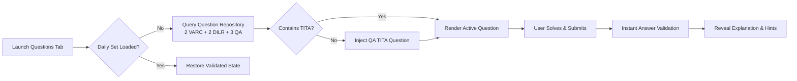
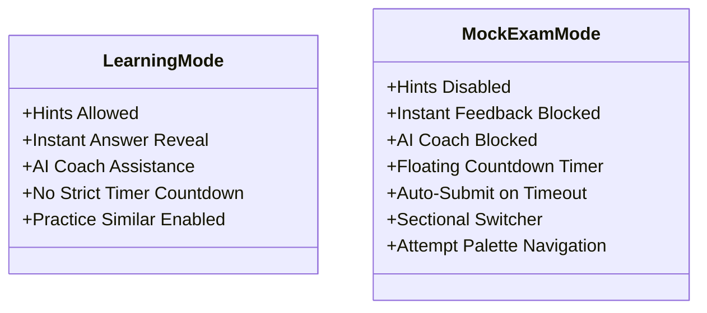
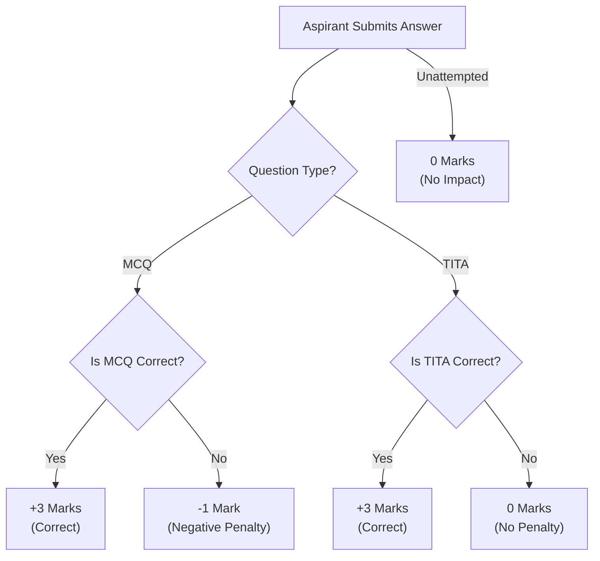
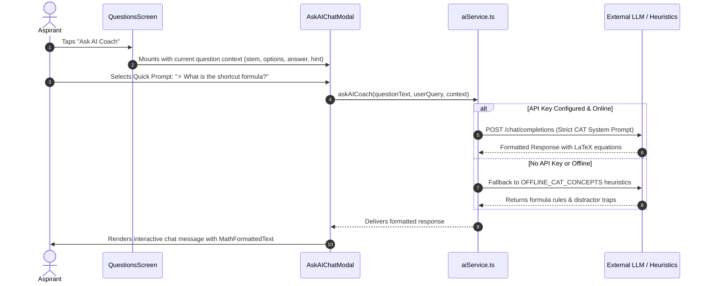

# Feature Deep-Dive

This document provides a thorough breakdown of all core aspirant-facing modules in EZCAT, detailing pedagogical purpose, user flows, scoring mechanics, and underlying business logic.

---

## 🎯 1. Daily Practice Engine

The **Daily Practice Engine** is the primary habit-building feature of EZCAT. It provides targeted micro-learning sessions without overwhelming the aspirant.

### Key Capabilities

- **Curated Sectional Balance**: Automatically selects **7 questions daily** (2 VARC, 2 DILR, 3 QA) sampled randomly from the question bank.
- **Mandatory TITA Inclusion**: The engine verifies that at least one question in the daily set is a non-MCQ Type-In-The-Answer (TITA) item. If absent, it queries `getTITAQuestion('QA')` and injects it automatically.
- **Question Palette Drawer**: Aspirants can tap the grid icon to open a modal grid showing progress across all 7 items (Answered, Unanswered, Current).
- **Practice Similar Question**: If a student struggles with a question, tapping **"Practice Similar"** queries `getSimilarQuestion(section, currentId)` to immediately append an analogous problem into the current session.
- **Bookmark for Review**: Tap the ribbon icon to toggle question bookmarks, saved persistently to `bookmarkedQuestionIds`.
- **Errata Reporting**: If an aspirant detects a typo or parsing flaw, tapping **"Report"** launches `ReportModal` to capture feedback categorized by issue type.

---

## ⏱️ 2. Mock Test Suite

Simulating authentic exam pressure is the single most important factor in CAT success. EZCAT offers three specialized mock formats:

| Mock Type | Duration | Questions | Scope & Composition | Strategic Objective |
| :--- | :--- | :--- | :--- | :--- |
| **Full CAT Mock** | **120 Min** | 66–76 Questions | Complete authentic previous sitting (VARC $\rightarrow$ DILR $\rightarrow$ QA) | Full mental stamina, time pacing, stamina testing |
| **Sectional Mock** | **40 Min** | 20–24 Questions | Single section selected from past exam papers | Sectional percentile boost, deep dive into one subject |
| **Mini Mock** | **15 Min** | 10 Questions | 3 VARC + 3 DILR + 4 QA mixed speed drill | Rapid decision making, quick question elimination |

### Exam Mode vs. Learning Mode Rules

When an aspirant initiates a Mock Exam, the interface shifts into a strict **Simulated Exam State**:

1. **Zero Mid-Test Feedback**: Answers are recorded silently; no correct/incorrect notifications or solutions are shown until final submission.
2. **Floating Section Timer**: A live countdown timer updates every second. When time expires, `handleSubmitMock()` triggers automatically.
3. **Comprehensive Question Palette**: Aspirants can quickly jump between questions, reviewing which items have been answered or left blank.
4. **Post-Mock Diagnostic Report (`MockAnalysisModal`)**: Upon submission, aspirants receive an instant scorecard detailing:
   - Raw total score and maximum possible score
   - Accuracy percentage ($\frac{\text{Correct}}{\text{Attempted}} \times 100$)
   - Time spent in minutes and seconds
   - Granular sectional breakdown (Attempted, Correct, Incorrect, Unattempted, Score)

---

## ⚖️ 3. Scoring Rules & Question Solver

EZCAT precisely implements the official IIM CAT marking scheme:

### MCQ Engine
- Single-choice selection across 4 options labeled **A, B, C, D**.
- Option labels and option texts are automatically normalized.
- Incorrect answers incur a **$-1$ point deduction**.

### TITA (Type-In-The-Answer) Engine
- Displays a dedicated text/numeric input box.
- Supports decimal points, negative signs, and natural number input.
- Zero penalty for incorrect entries:
  $$\text{Expected Value of Guess} = (+3 \times p) + (0 \times (1-p)) \ge 0$$
- Normalization regex strips non-numeric artifacts such as `"Rs."`, `"$"`, `","`, `"litres"`, or `"%"`.

---

## 📊 4. Performance Analytics Engine (`analyticsEngine.ts`)

Rather than showing static mock counters, EZCAT continuously evaluates the user's progress through four predictive metrics:

### 1. Predicted Percentile Projection
Calculates an estimated percentile milestone based on cumulative question accuracy and practice volume:

$$\text{Raw Percentile} = 75.0 + (\text{Accuracy Ratio} \times 20.0) + \min(4.0, \text{Total Attempts} \times 0.2)$$

- Bounded between $50.0$ and $99.9$.
- Displays a visual **Semi-Gauge** on the Home tab with a dynamic delta tracker (e.g. `↑ 3.2`).

### 2. CAT Prep Readiness Score
A unified readiness index from $10\%$ to $99\%$ combining accuracy and volume:

$$\text{Readiness Score} = \text{Round}\left(\left(\frac{\text{Correct}}{\text{Total}} \times 65\right) + \left(\min\left(1.0, \frac{\text{Total}}{40}\right) \times 30\right) + 5\right)$$

### 3. Topic Diagnostics (Weak vs. Strong)
Every question attempt is classified into canonical CAT sub-topics:
- **QA**: Arithmetic, Algebra, Geometry, Number Systems.
- **DILR**: Arrangements, Caselets, Charts & Graphs, Games & Tournaments.
- **VARC**: Reading Comprehension, Para Jumbles, Para Summary, Odd One Out.

Sub-topics with $< 70\%$ accuracy are categorized as **Weak Areas**; sub-topics with $\ge 70\%$ accuracy are categorized as **Strengths**.

### 4. 7-Day Consistency Tracker
Monitors active daily practice across a rolling 7-day window, rendering a high-contrast bar chart (`M, T, W, T, F, S, S`) reflecting daily practice volume.

---

## 🤖 5. AI Exam Coach & Mentoring Layer

EZCAT features a context-aware AI mentor accessible in two distinct locations:
1. **Coach Screen (`CoachScreen.tsx`)**: High-level diagnostic reports, prep roadmaps, and custom LLM configuration.
2. **In-Solver Modal (`AskAIChatModal.tsx`)**: Real-time problem clarification right on the active question screen.

### LaTeX Equation & Math Renderer (`MathFormattedText`)
Mathematical equations in CAT (algebraic roots, exponents, geometry proofs) require clean visual formatting. EZCAT includes a built-in parser that identifies:
- **Block Formulas (`$$...$$`)**: Rendered inside standalone high-contrast equation cards with horizontal scrolling support.
- **Inline Variables (`$...$`)**: Highlighted monospace text for variables like $x$, $y$, or $\theta$.

### Quick Prompt Shortcuts
To minimize typing on mobile devices, the AI Coach provides one-tap prompt shortcuts:
- `💡 Explain step 1`: Explains how to break down the first step of the problem.
- `⚡ What is the shortcut formula?`: Suggests ratio multipliers or option elimination tricks.
- `🔍 Why is option B incorrect?`: Analyzes distractor traps and common calculation mistakes.
- `⏱️ How to solve in <90s?`: Shares speed-oriented exam heuristics.
- `🎯 What is the core theorem?`: References underlying mathematical theorems (Euler's Totient, Apollonius, etc.).
