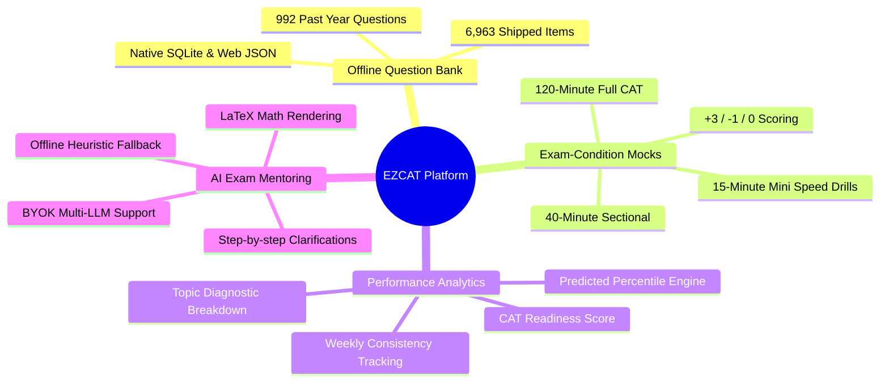
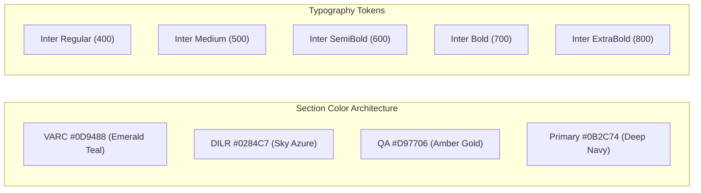

# Project Overview: EZCAT

## 🌟 Executive Summary

**EZCAT** is an open-source, offline-first mobile and web application engineered to transform how students and professionals prepare for the **Common Admission Test (CAT)** — the premier management entrance examination administered by the Indian Institutes of Management (IIMs).

Traditional CAT preparation in India suffers from high paywalls, bloated proprietary platforms, aggressive pay-per-test marketing, and internet dependency. EZCAT democratizes CAT prep by delivering an uncompromising, ad-free, high-speed learning environment featuring authentic exam questions, rigorous exam-condition test simulation, and AI-driven coaching on a modern open-source foundation.

---

## 🎯 Target Audience

EZCAT is crafted specifically for the diverse spectrum of CAT candidates:

1. **Undergraduate Students & Freshers**  
   Aspirants balancing final-year university degrees who need targeted daily micro-practice (7-10 questions per day) that systematically covers foundational topics across all three exam sections.

2. **Working Professionals**  
   Candidates with constrained study schedules who require offline mobile access during commutes or work breaks, zero login friction, and concise 15-minute speed drills.

3. **Experienced Repeaters (99+ Percentile Chasers)**  
   Advanced aspirants seeking unadulterated past-year papers (2017–2024), full 120-minute time-constrained simulations without disruptive mid-test feedback, and granular topic diagnostic reports.

---

## 🏛️ Understanding the IIM CAT Examination

The Common Admission Test is notorious for testing decision-making, speed, accuracy, and mental endurance under pressure. The modern examination spans **120 minutes (2 hours)** divided into three non-switchable, strictly timed **40-minute sections**:

| Section | Code | Full Section Name | Typical Questions | Section Duration | Scoring Rules |
| :--- | :--- | :--- | :--- | :--- | :--- |
| **Section I** | `VARC` | Verbal Ability & Reading Comprehension | 24 Questions (16 RC, 8 VA) | 40 Minutes | MCQ: $+3$ / $-1$ TITA: $+3$ / $0$ |
| **Section II** | `DILR` | Data Interpretation & Logical Reasoning | 20 Questions (4 sets of 5 or combinations) | 40 Minutes | MCQ: $+3$ / $-1$ TITA: $+3$ / $0$ |
| **Section III** | `QA` | Quantitative Aptitude | 22 Questions | 40 Minutes | MCQ: $+3$ / $-1$ TITA: $+3$ / $0$ |
| **Total** | **CAT** | **All Sections** | **66 Questions (198 Marks)** | **120 Minutes** | **Fixed Section Order** |

### Question Formats & Marking System

The examination employs two distinct question paradigms:

1. **Multiple Choice Questions (MCQ)**:  
   Standard single-select questions with 4 options.  
   $$\text{Score} = +3 \text{ (Correct)}, \quad -1 \text{ (Incorrect)}, \quad 0 \text{ (Unattempted)}$$

2. **Type-In-The-Answer (TITA)**:  
   Non-MCQ questions requiring the candidate to type the answer numerically or textually into an on-screen input field.  
   $$\text{Score} = +3 \text{ (Correct)}, \quad 0 \text{ (Incorrect)}, \quad 0 \text{ (Unattempted)}$$

> [!IMPORTANT]
> The absence of negative marking on TITA questions fundamentally alters exam strategy: candidates should attempt all TITA questions before running out of time. EZCAT mirrors this scoring logic throughout its daily solver and mock exams.

---

## 🚀 Key Highlights & Architectural Strengths

### 1. 100% Offline-First Architecture
Unlike web-only subscription portals, EZCAT bundles a compiled SQLite database (`cat_questions.db`) containing **6,963 questions** directly into the application binary. On native iOS and Android devices, queries are processed locally in sub-millisecond time. On the Web, an optimized JSON in-memory repository guarantees zero runtime latency.

### 2. Authentic Exam-Condition Mock Suite
EZCAT differentiates between **Learning Mode** and **Exam Mode**:
- In **Learning Mode (Daily Practice)**: Candidates can request hints, reveal step-by-step explanations, practice similar concept questions, and chat with the AI Coach.
- In **Exam Mode (Mocks)**: All hints, explanations, answer reveals, and AI interventions are strictly locked. Candidates must manage section clocks, navigate a realistic question palette (attempted, unattempted, active), and submit the test to receive a post-exam diagnostic review.

### 3. Smart Answer Verification Engine
Real student answers in TITA questions often contain formatting variance (e.g. typing `"1120 litres"`, `"Rs. 6,000"`, `"$100"`, `"7:3"`, or `"53%"`). EZCAT features a dedicated mathematical parsing adapter that extracts normalized values, compares numeric ranges with floating-point tolerance ($\epsilon < 10^{-5}$), and checks normalized alphanumeric strings without false rejections.

### 4. Transparent Analytics (No Inflated Metrics)
Commercial test series frequently generate arbitrary "All-India Percentiles" based on opaque marketing algorithms. EZCAT’s analytics engine computes transparent scores:
- **Raw CAT Score**: Real tally with $+3$ and $-1$ rules.
- **Sectional Accuracy**: Pure mathematical ratio of correct versus attempted items.
- **CAT Readiness Score**: Weighted index combining accuracy ($65\%$) and consistency volume ($30\%$).
- **Predicted Percentile**: Algorithmic projection based on historical CAT score-to-percentile conversion curves.

### 5. Private, Bring-Your-Own-Key (BYOK) AI Mentoring
Students who wish to utilize Large Language Models (LLMs) can securely connect their own API key (supporting OpenAI, OpenRouter, DeepSeek, Groq, or custom endpoints). Keys are encrypted via hardware keychains on mobile devices (`expo-secure-store`). For users without API keys or working offline, EZCAT provides a built-in heuristic diagnostic engine delivering comprehensive formulas, exam tips, and common traps.

---

## 🎨 Design System & Visual Identity

EZCAT adheres to a clean, high-contrast, distraction-free aesthetic designed for long study sessions:

### Color Palette

- **Primary Navy (`#0B2C74`)**: Headers, primary calls to action, brand logos.
- **VARC Emerald (`#0D9488`)**: Badges, section indicators, reading comprehension markers.
- **DILR Azure (`#0284C7`)**: Logic grids, arrangement tags, caselet indicators.
- **QA Amber (`#D97706`)**: Mathematics markers, formulas, equation cards.
- **Canvas (`#F8FAFC` & `#FFFFFF`)**: High-contrast, clean reading surfaces with subtle borders (`#E2E8F0`).

### Multi-Device Presentation

On Android and iOS, EZCAT renders full-screen with native edge-to-edge support. On Desktop Web browsers, the app wraps inside a reactive `MobileFrame` (max-width `390px` with drop shadows and subtle border radius), preserving an authentic mobile device viewport while running cleanly in modern browser tabs.
